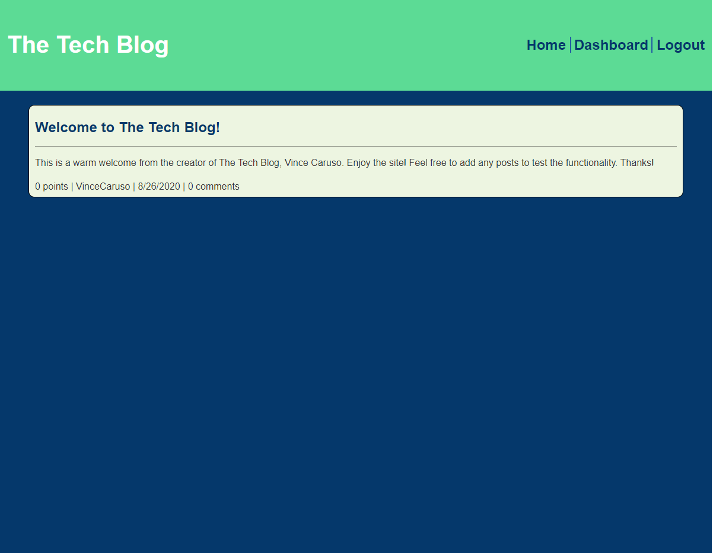

# The Tech Blog   
## Description

A sample blog website where users can view posts and their comments. When logged in, users can create their own posts, edit or delete them, and leave comments on other posts.

## Live Application
https://secure-hollows-14734.herokuapp.com/

## Table of Contents

* [Installation](#installation)
* [Usage](#usage)
* [License](#license)
* [Contributing](#contributing)
* [Tests](#tests)
* [Questions](#questions)

## Installation

Clone the repo, install node modules, and create a .env file with DB_NAME, DB_USER, and DB_PW variables defined. Create a mysql database called tech_blog_db.

## Usage

Run 'npm start' to start the server from your local machine. Or navigate to the link provided above to interact with the application deployed live on heroku.

## License

No License!

## Contributing

Contribute at will

## Tests

N/A

## Screenshot

## Questions

If you have any questions, please contact me via [email](vinnycar0923@gmail.com) or on [Github](http://github.com/vcaruso0923).
